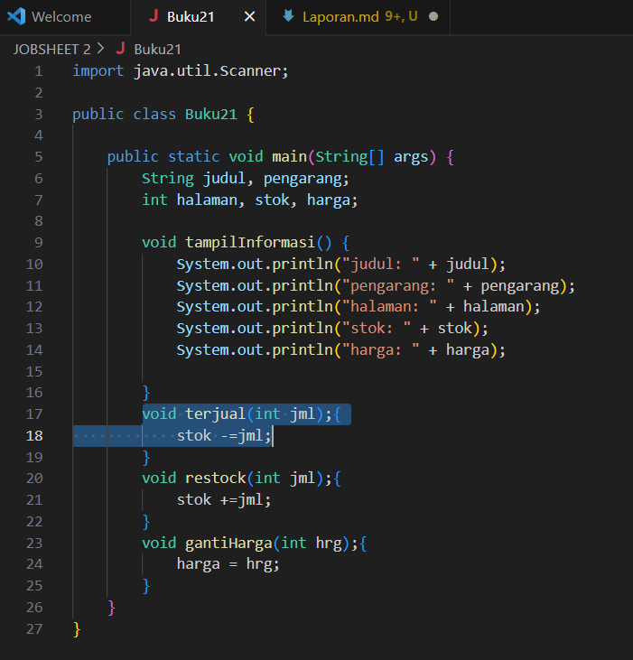
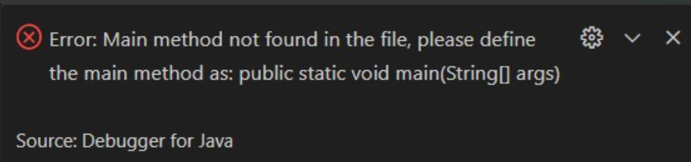
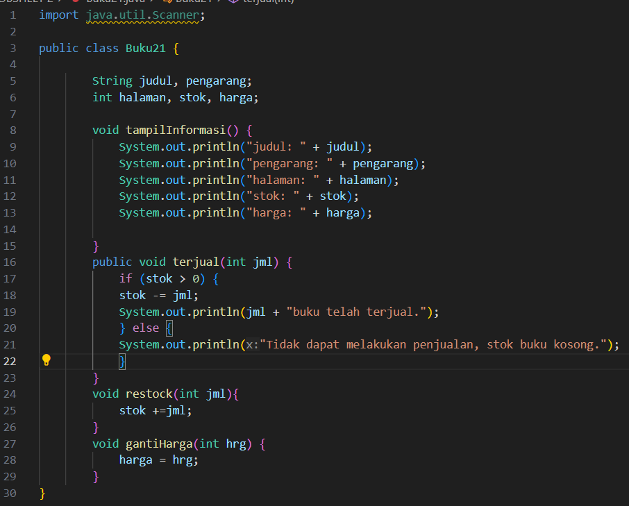
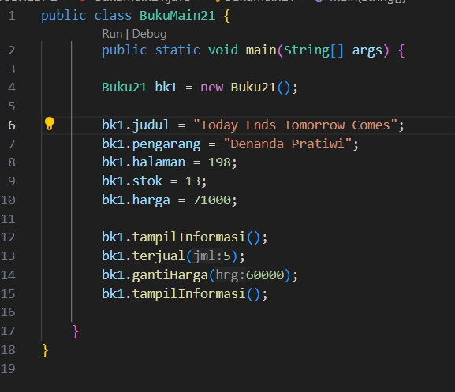
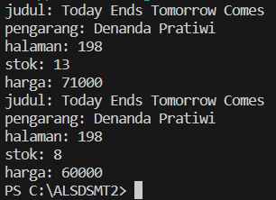
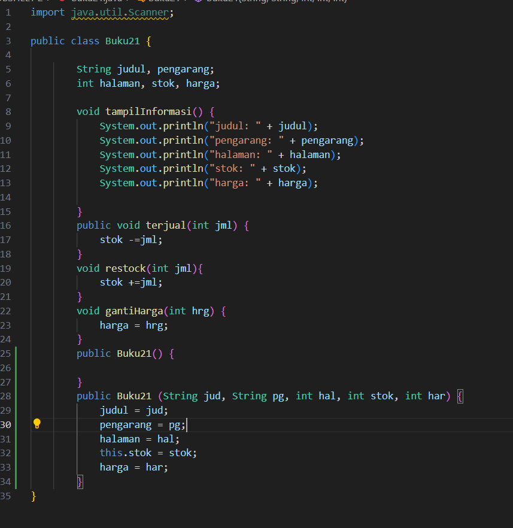
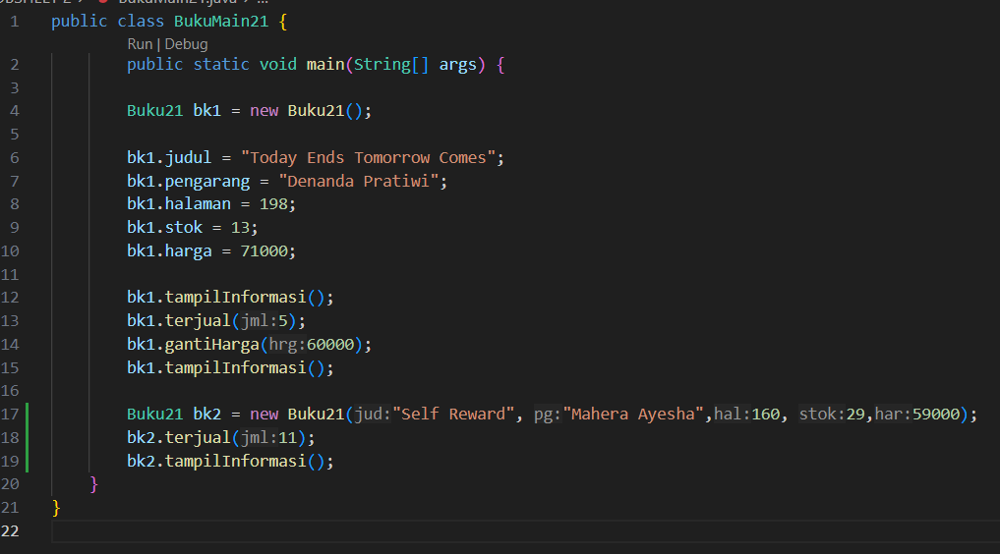
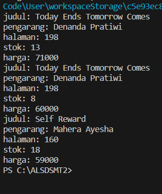
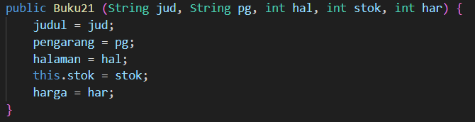
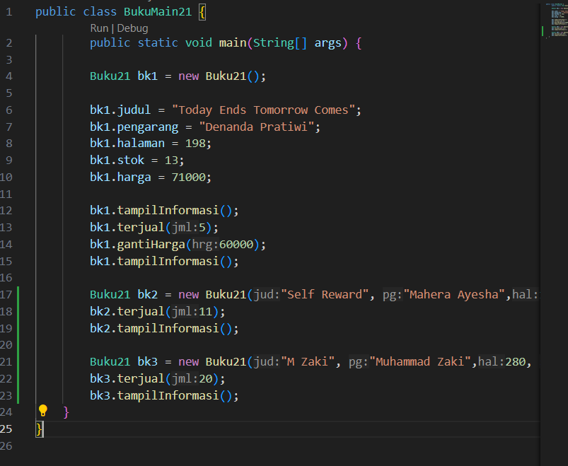

# Laporan Praktikum 2

## Percobaan 1: Deklarasi class, Atribut dan method

Kode Program

Hasil Running

 Pertanyaan 
1. Sebutkan dua karakteristik class atau object! 
2. Perhatikan class Buku pada Praktikum 1 tersebut, ada berapa atribut yang dimiliki oleh class 
Buku? Sebutkan apa saja atributnya! 
3. Ada berapa method yang dimiliki oleh class tersebut? Sebutkan apa saja methodnya! 
4. Perhatikan method terjual() yang terdapat di dalam class Buku. Modifikasi isi method tersebut 
sehingga proses pengurangan hanya dapat dilakukan jika stok masih ada (lebih besar dari 0)! 
5. Menurut Anda, mengapa method restock() mempunyai satu parameter berupa bilangan int? 
6. Commit dan push kode program ke Github

Jawaban
1. Inheritance dan Encapsulation
2. Class Buku memiliki 5 atribut, yaitu:
    1. judul (String): untuk menyimpan judul buku.
    2. pengarang (String): untuk menyimpan nama pengarang buku.
    3. halaman (int): untuk menyimpan jumlah halaman buku.
    4. stok (int): untuk menyimpan jumlah stok buku yang tersedia.
    5. harga (int): untuk menyimpan harga buku.
3. Class Buku memiliki 4 method, yaitu:
    1. tampilInformasi(): Method ini digunakan untuk menampilkan informasi judul, pengarang, halaman, stok, dan harga buku.
    2. terjual(int jml): Method ini digunakan untuk mengurangi jumlah stok buku berdasarkan jumlah buku yang terjual.
    3. restock(int jml): Method ini digunakan untuk menambah jumlah stok buku berdasarkan jumlah buku yang restock.
    4. gantiHarga(int hrg): Method ini digunakan untuk mengganti harga buku dengan harga baru.
4. 

5. Karena parameter tersebut digunakan untuk menentukan jumlah buku yang akan ditambhakan ke stok.
6. -

## Percobaan 2:  Instansiasi Object, serta Mengakses Atribut dan Method

Kode Program

Hasil Running

Pertanyaan
1. Pada class BukuMain, tunjukkan baris kode program yang digunakan untuk proses instansiasi! 
Apa nama object yang dihasilkan? 
2. Bagaimana cara mengakses atribut dan method dari suatu objek? 
3. Mengapa hasil output pemanggilan method tampilInformasi() pertama dan kedua berbeda?

Jawaban
1. kode program yang digunakan untuk proses instansiasi adalah Buku21 bk1 = new Buku21();, dan nama object yang dihasilkan adalah 'bk1'
2. cara mengakses atribut dan method dari suatu objek adalah dengan menggunakan nama objek yang telah diinstansiasi dan operator titik (.) yang digunakan untuk mengakses atribut dan method dari objek tersebut
3. pemanggilan method tampilInformasi() pertama dan kedua berbeda karena  terdapat perubahan nilai pada atribut 'stok' dan 'harga' setelah method 'terjual()' dan gantiHarga()' dipanggil.

## Percobaan 3: Membuat Konstruktor

Kode Program

Hasil Running

Pertanyaan
1. Pada class Buku di Percobaan 3, tunjukkan baris kode program yang digunakan untuk 
mendeklarasikan konstruktor berparameter! 
2. Perhatikan class BukuMain. Apa sebenarnya yang dilakukan pada baris program berikut?  
3. Hapus konstruktor default pada class Buku, kemudian compile dan run program. Bagaimana 
hasilnya? Jelaskan mengapa hasilnya demikian! 
4. Setelah melakukan instansiasi object, apakah method di dalam class Buku harus diakses 
secara berurutan? Jelaskan alasannya! 
5. Buat object baru dengan nama buku<NamaMahasiswa> menggunakan konstruktor berparameter dari class Buku! 
6. Commit dan push kode program ke Github 

Jawaban
1. 
2. kode tersebut membuat object baru berupa bk2 dari kelas Buku21, dan nilai atributnya diisi langsung saat pembuatan objectmenggunakan konstruktor berparameter
3. kode akan eror dan tidak bisa di run
4. tidak, karena ada beberapa alasan yaitu:
    A. Method dalam sebuah class bersifat independen satu sama lain. 
    B. Method hanya menjalankan fungsionalitas yang telah didefinisikan di dalamnya. Method tidak saling tergantung satu sama lain.
    D. Urutan eksekusi method tergantung pada desain program dan logika bisnis yang ingin diimplementasikan.
    D. Urutannya tidak harus sesuai deklarasi method di dalam class.
    E. urutan pemanggilan method bersifat fleksibel dan tergantung logically program yang ingin dibuat. 
5. 
6. -