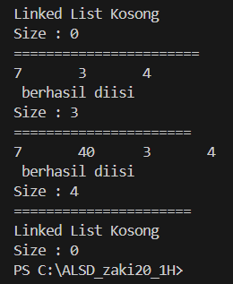
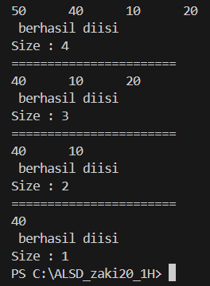
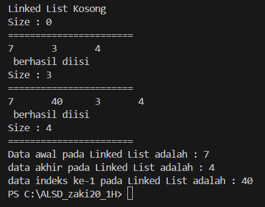

## JOBSHEET 11

Percobaan 1

Output

> 

Pertanyaan

1. Jelaskan perbedaan antara single linked list dengan double linked lists!
2. Perhatikan class Node, di dalamnya terdapat atribut next dan prev. Untuk apakah atribut tersebut?
3. Perhatikan konstruktor pada class DoubleLinkedLists. Apa kegunaan inisialisasi atribut head dan size seperti pada gambar berikut ini?
4. Pada method addFirst(), kenapa dalam pembuatan object dari konstruktor class Node prev dianggap sama dengan null?
Node newNode = new Node(null, item, head);
5. Perhatikan pada method addFirst(). Apakah arti statement head.prev = newNode ?
6. Perhatikan isi method addLast(), apa arti dari pembuatan object Node dengan mengisikan parameter prev dengan current, dan next dengan null?
Node newNode = new Node(current, item, null);
7. Pada method add(), terdapat potongan kode program sebagai berikut:
jelaskan maksud dari bagian yang ditandai dengan kotak kuning.

Jawaban

1. 
- Single Linked List:
a. Setiap node hanya memiliki referensi ke node berikutnya (next).
b. Navigasi hanya dapat dilakukan satu arah, dari head ke tail.
c. Untuk mengakses node tertentu, harus melakukan traversal dari head hingga node yang ingin diakses.
d. Tidak dapat melakukan traversal mundur dengan efisien.
e. Penghapusan node terakhir membutuhkan traversal hingga node sebelum node terakhir.

- Double Linked List:
a. Setiap node memiliki referensi ke node sebelumnya (prev) dan node berikutnya (next).
b. Navigasi dapat dilakukan dalam dua arah, dari head ke tail atau sebaliknya.
c. Dapat mengakses node tertentu dari kedua arah, baik dari head maupun tail.
d. Memungkinkan traversal mundur dengan mudah dan efisien.
e. Penghapusan node terakhir dapat dilakukan dengan mudah karena memiliki referensi ke node sebelumnya.

2. Atribut next dan prev pada class Node digunakan untuk menyimpan referensi ke node sebelumnya dan node berikutnya dalam double linked list. next menyimpan referensi ke node berikutnya, sedangkan prev menyimpan referensi ke node sebelumnya.
3. 
- head = null: Mengatur referensi head menjadi null pada saat pembuatan objek DoubleLinkedList. Ini dilakukan karena saat awal pembuatan, linked list masih kosong.
- size = 0: Mengatur nilai size menjadi 0 pada saat pembuatan objek DoubleLinkedList. Ini dilakukan karena saat awal pembuatan, linked list masih belum memiliki node/elemen di dalamnya.
4. Pada baris Node newNode = new Node(null, item, head); dalam method addFirst(), argumen null digunakan sebagai nilai untuk atribut prev dari node baru yang akan dibuat. Hal ini dilakukan karena node baru yang ditambahkan di awal linked list tidak memiliki node sebelumnya (prev), sehingga nilai null digunakan untuk mengindikasikan bahwa node tersebut adalah node pertama dalam linked list.
5. Statement head.prev = newNode dalam method addFirst() berarti mengupdate referensi prev dari node head menjadi menunjuk ke node baru (newNode) yang baru saja dibuat. Hal ini dilakukan agar node head memiliki referensi yang tepat ke node sebelumnya setelah penambahan node baru di awal linked list.
6. Pada baris Node newNode = new Node(current, item, null); dalam method addLast(), parameter current digunakan sebagai argumen untuk atribut prev dari node baru yang akan dibuat. Ini karena node baru akan ditambahkan setelah node current, sehingga node sebelumnya (prev) dari node baru adalah node current, argumen null untuk parameter next digunakan karena node baru yang ditambahkan akan menjadi node terakhir dalam linked list. Oleh karena itu, tidak ada node setelahnya, sehingga referensi next ditetapkan sebagai null.
7. 
- current.prev == null akan bernilai true jika current adalah node pertama dalam linked list (node head).
- Dalam kondisi ini, node baru (newNode) dibuat dengan prev bernilai null (karena node baru akan menjadi node pertama), item adalah data yang akan disimpan, dan next menunjuk ke current (yang sebelumnya adalah node head).
- referensi head diperbarui untuk menunjuk ke newNode, sehingga newNode menjadi node pertama dalam linked list.

Percobaan 2

Output

>  

Pertanyaan

1. Apakah maksud statement berikut pada method removeFirst()?
head = head.next;
head.prev = null;
2. Bagaimana cara mendeteksi posisi data ada pada bagian akhir pada method removeLast()?
3. Jelaskan alasan potongan kode program di bawah ini tidak cocok untuk perintah remove!
4. Jelaskan fungsi kode program berikut ini pada fungsi remove!

Jawaban

1. 
- head = head.next;: Statement ini mengubah referensi head menjadi menunjuk ke node setelah node head saat ini. Dengan kata lain, node head lama akan dihapus dari linked list, dan node setelah head lama menjadi node head yang baru.
- head.prev = null;: Statement ini dijalankan setelah head diubah menjadi menunjuk ke node berikutnya. Statement ini mengubah referensi prev dari node head baru menjadi null. Hal ini dilakukan karena node head baru tidak memiliki node sebelumnya, sehingga referensi prev harus diatur ke null.
2. dengan cara memeriksa apakah current.next adalah null. Jika current.next adalah null, maka current adalah node terakhir dalam linked list.
3. 
4. 
- current.prev.next = current.next; menghubungkan node sebelum current dengan node setelah current. Dengan kata lain, node sebelum current akan menunjuk ke node setelah current, sehingga current akan dihapus dari linked list.
- current.next.prev = current.prev; memperbarui referensi prev dari node setelah current agar menunjuk ke node sebelum current. Ini diperlukan agar integritas referensi prev tetap terjaga setelah penghapusan current.

percobaan 3

Output

> 

Pertanyaan

1. Jelaskan method size() pada class DoubleLinkedLists!
2. Jelaskan cara mengatur indeks pada double linked lists supaya dapat dimulai dari indeks ke1!
3. Jelaskan perbedaan karakteristik fungsi Add pada Double Linked Lists dan Single Linked Lists!
4. Jelaskan perbedaan logika dari kedua kode program di bawah ini!

Jawaban

1. 
