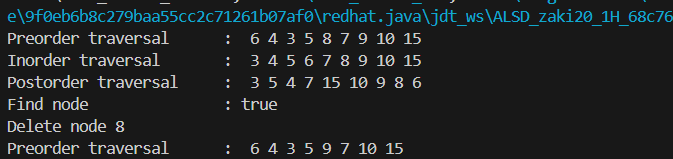
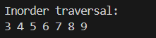

## Jobsheet 12

# Percobaan 1

Output

> 

Soal
1. Mengapa dalam binary search tree proses pencarian data bisa lebih efektif dilakukan dibanding 
binary tree biasa? 
2. Untuk apakah di class Node, kegunaan dari atribut left dan right? 
3.  a. Untuk apakah kegunaan dari atribut root di dalam class BinaryTree? 
    b. Ketika objek tree pertama kali dibuat, apakah nilai dari root? 
4. Ketika tree masih kosong, dan akan ditambahkan sebuah node baru, proses apa yang akan terjadi? 
5. Perhatikan method add(), di dalamnya terdapat baris program seperti di bawah ini. Jelaskan 
secara detil untuk apa baris program tersebut? 
    if(data<current.data) { 
    if (current.left! = null ) { 
    current = current.left; 
    } else { 
    current.left = new Node(data); 
    break; 
    } 
} 

Jawaban
1. Dalam binary search tree (BST), proses pencarian data lebih efektif dibandingkan dengan binary tree biasa karena BST memiliki sifat-sifat khusus yang mengatur penyusunan node-node di dalamnya. Pada BST, nilai pada setiap node di subtree kiri selalu lebih kecil dari nilai node induknya, dan nilai pada setiap node di subtree kanan selalu lebih besar dari nilai node induknya. Sifat ini memungkinkan pencarian data dilakukan dengan lebih efisien menggunakan pendekatan "divide and conquer". Dengan membandingkan nilai yang dicari dengan nilai pada node saat ini
2. Dalam class Node, atribut left dan right digunakan untuk menyimpan referensi ke node anak kiri dan node anak kanan dari node tersebut. Atribut left menunjuk ke node anak di sebelah kiri node saat ini, sedangkan atribut right menunjuk ke node anak di sebelah kanan node saat ini. Dengan menggunakan atribut ini dapat menyusun hubungan antara node-node dalam struktur tree dan melakukan traversal atau pengaksesan node-node secara efisien.
3.  a. Atribut root dalam class BinaryTree digunakan untuk menyimpan     referensi ke node akar (root) dari binary tree. Node akar adalah node paling atas dalam struktur tree dan menjadi titik awal untuk mengakses dan menelusuri seluruh node dalam tree.
    b. Ketika objek tree pertama kali dibuat, nilai dari root adalah null.
4. Ketika tree masih kosong dan akan ditambahkan sebuah node baru, proses yang terjadi adalah:

- Node baru tersebut akan menjadi node akar (root) dari tree.
- Atribut root pada objek tree akan diperbarui untuk menunjuk ke node baru tersebut.
- Setelah itu, tree tidak lagi kosong dan memiliki satu node yaitu node akar.
5. Baris program tersebut adalah bagian dari logika penyisipan node baru ke dalam BST dengan menjaga sifat-sifat BST, yaitu nilai yang lebih kecil ditempatkan di subtree kiri dan nilai yang lebih besar ditempatkan di subtree kanan.

# Percobaan 2

Output

> 

Soal

1. Apakah kegunaan dari atribut data dan idxLast yang ada di class BinaryTreeArray? 
2. Apakah kegunaan dari method populateData()? 
3. Apakah kegunaan dari method traverseInOrder()? 
4. Jika suatu node binary tree disimpan dalam array indeks 2, maka di indeks berapakah posisi 
left child dan rigth child masin-masing? 
5. Apa kegunaan statement int idxLast = 6 pada praktikum 2 percobaan nomor 4?

Jawaban

1. Atribut data pada class BinaryTreeArray adalah array yang digunakan untuk menyimpan nilai-nilai node dalam binary tree. Setiap elemen array mewakili sebuah node, dan indeks array menentukan posisi node dalam struktur tree.
2. Method populateData() digunakan untuk mengisi binary tree dengan nilai-nilai yang diberikan melalui sebuah array. Method ini menerima dua parameter: array data yang berisi nilai-nilai yang akan dimasukkan ke dalam tree, dan idxLast yang menunjukkan indeks terakhir yang valid dalam array data.
Dengan memanggil method populateData() dapat menginisialisasi binary tree dengan nilai-nilai yang sudah ditentukan sebelumnya.
3. Method traverseInOrder() digunakan untuk melakukan traversal in-order pada binary tree. Traversal in-order mengunjungi node-node dalam urutan berikut: subtree kiri, root, subtree kanan.
Dalam implementasi traverseInOrder() pada class BinaryTreeArray, method ini menerima parameter idxStart yang menunjukkan indeks awal traversal. Method ini kemudian memanggil dirinya sendiri secara rekursif untuk mengunjungi subtree kiri, mencetak nilai node saat ini, dan kemudian mengunjungi subtree kanan.
4. Jika suatu node binary tree disimpan dalam array indeks 2, maka:

- Left child dari node tersebut akan berada pada indeks 2 * 2 + 1 = 5.
- Right child dari node tersebut akan berada pada indeks 2 * 2 + 2 = 6.

Secara umum, jika indeks node saat ini adalah i, maka:

- Left child akan berada pada indeks 2 * i + 1.
- Right child akan berada pada indeks 2 * i + 2.
5. Pada praktikum 2 percobaan nomor 4, statement int idxLast = 6 digunakan untuk menentukan indeks terakhir yang valid dalam array data. Dalam contoh ini, array data berisi elemen-elemen {6, 4, 8, 3, 5, 7, 9, 0, 0, 0}, dan indeks terakhir yang valid adalah 6, karena elemen-elemen setelah indeks 6 adalah 0 (yang menandakan posisi kosong dalam tree).
Dengan menetapkan idxLast = 6, kita memberitahu class BinaryTreeArray bahwa elemen-elemen yang valid dalam array data adalah dari indeks 0 hingga 6. Ini membantu dalam operasi-operasi seperti traversal dan penambahan node baru pada tree.

Tugas Praktikum  
1. Buat method di dalam class BinaryTree yang akan menambahkan node dengan cara 
rekursif. 
2. Buat method di dalam class BinaryTree untuk menampilkan nilai paling kecil dan yang 
paling besar yang ada di dalam tree. 
3. Buat method di dalam class BinaryTree untuk menampilkan data yang ada di leaf. 
4. Buat method di dalam class BinaryTree untuk menampilkan berapa jumlah leaf yang ada 
di dalam tree. 
5. Modifikasi class BinaryTreeArray, dan tambahkan :  
• method add(int data) untuk memasukan data ke dalam tree  
• method traversePreOrder() dan traversePostOrder()

Jawaban
sudah ada di kode program
