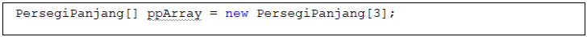

# Laporan Praktikum 3

## Percobaan 1:  Membuat Array dari Object, Mengisi dan Menampilkan

kode Program

Hasil Running

Pertanyaan
1. Berdasarkan uji coba 3.2, apakah class yang akan dibuat array of object harus selalu memiliki
atribut dan sekaligus method?Jelaskan!
2. Apakah class PersegiPanjang memiliki konstruktor?Jika tidak, kenapa dilakukan pemanggilan
konstruktur pada baris program berikut :

3. Apa yang dimaksud dengan kode berikut ini:

4. Apa yang dimaksud dengan kode berikut ini:

5. Mengapa class main dan juga class PersegiPanjang dipisahkan pada uji coba 3.2?

Jawaban
1. Tidak, class yang akan dibuat array of object tidak harus selalu memiliki atribut dan method sekaligus karena:
    a. Class yang hanya berisi atribut saja tetap bisa dibuat array of object-nya.
    b. Class yang hanya berisi method saja, tanpa ada atribut, juga tetap bisa dibuat array of object-nya
2. Tidak, Karena hal terssebut sudah seharusnya dilakukan ketika instansiasi meskipun tidak memiliki konstruktor
3. Kode yang digunakan untuk melakukan instansiasi objek
4. Kode yang digunakan untuk melakukan deklrasi objek
5. pemisahan ini mengikuti prinsip desain yang baik dalam OOP yaitu pemilahan tugas dan reusability class

## Percobaan 2: Menerima Input Isian Array Menggunakan Looping

Kode Program :

Hasil Running :

Pertanyaan
1. Apakah array of object dapat diimplementasikan pada array 2 Dimensi?
2. Jika jawaban soal no satu iya, berikan contohnya! Jika tidak, jelaskan!
3. Jika diketahui terdapat class Persegi yang memiliki atribut sisi bertipe integer, maka kode
dibawah ini akan memunculkan error saat dijalankan. Mengapa?

4. Modifikasi kode program pada praktikum 3.3 agar length array menjadi inputan dengan Scanner!
5. Apakah boleh Jika terjadi duplikasi instansiasi array of objek, misalkan saja instansiasi dilakukan
pada ppArray[i] sekaligus ppArray[0]?Jelaskan 

Jawaban
1. Bisa, karena array of object sama sepert implementasi array
2. PresegiPanjang[][] ppArray = new PresegiPanjang[i][j];
3. Kodenya akan eror dikarenakan tidak ada instansiasi
4. System.out.print("Berapa banyak persegi panjang ? : ");
   int i = sc.nextInt();
   PresegiPanjang[] ppArray = new PresegiPanjang[i];
5. Boleh, karena dalam ppArray[i] berupa looping sehingga instansiasi sebenarnya sudah dilakukan

## Percobaan 3

Kode Program :

Hasil Running :

pertanyaan
1. Dapatkah konstruktor berjumlah lebih dalam satu kelas? Jelaskan dengan contoh!
2. Jika diketahui terdapat class Segitiga seperti berikut ini:
    
   Tambahkan konstruktor pada class Segitiga tersebut yang berisi parameter int a, int t
   yang masing-masing digunakan untuk mengisikan atribut alas dan tinggi.
3. Tambahkan method hitungLuas() dan hitungKeliling() pada class Segitiga
   tersebut. Asumsi segitiga adalah segitiga siku-siku. (Hint: Anda dapat menggunakan bantuan
   library Math pada Java untuk mengkalkulasi sisi miring)
4. Pada fungsi main, buat array Segitiga sgArray yang berisi 4 elemen, isikan masing-masing
   atributnya sebagai berikut:
    sgArray ke-0 alas: 10, tinggi: 4
    sgArray ke-1 alas: 20, tinggi: 10
    sgArray ke-2 alas: 15, tinggi: 6
    sgArray ke-3 alas: 25, tinggi: 10
5. Kemudian menggunakan looping, cetak luas dan keliling dengan cara memanggil method
   hitungLuas() dan hitungKeliling().

Jawaban
1. Bisa, didalam satu class dapat memuat banyk konstuktor, contoh

2. 
3. 