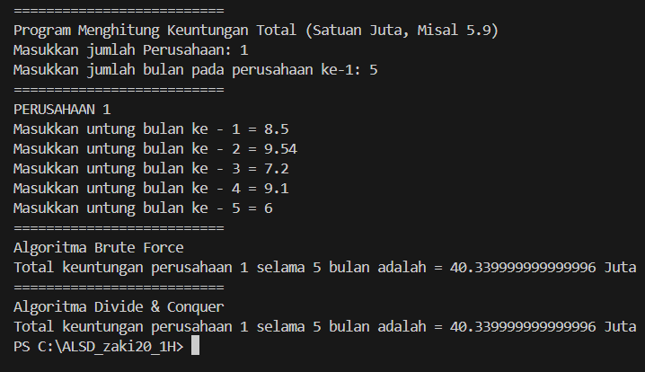

## Laporan Praktikum 4

# Percobaan 1 : Menghitung Nilai Faktorial dengan Algoritma Brute Force dan Divide and Conquer

Kode Program

> 

Main

> 

Vertifikasi Hasil Percobaan

> 

Pertanyaan

1. Pada base line Algoritma Divide Conquer untuk melakukan pencarian nilai faktorial, jelaskan
perbedaan bagian kode pada penggunaan if dan else!
2. Apakah memungkinkan perulangan pada method faktorialBF() dirubah selain menggunakan for?Buktikan!
3. Jelaskan perbedaan antara fakto *= i; dan int fakto = n * faktorialDC(n-1); !

Jawaban

1. pada statement if jika nilai n sama dengan 1 maka nilai kembalian adalah 1 karena 1 faktorial hasilnya tetap satu, berbeda dengan else adalah mencari hasil fakto dengan mengalikan nilai n dengan n-1
2. ya. memungkinkan dikarenakan bisa menggunakan while, do while, dan perulangan lainnya,akan tetapi jika menggunakan metode rekrusif akn jadi metode divide and conquer.

> 

3. fakto *= i adalah untuk brute force karena kita mencari hasilnya satu persatu sedangkan fakto = n * faktorialDC(n-1) adalah untuk devide and conquer karena kita mencari kembaliannya secara langsung

# Percobaan 2

Kode Program

> 

Main

> 

vertifikasi hasil kode program

> 

Pertanyaan

1. Jelaskan mengenai perbedaan 2 method yang dibuat yaitu PangkatBF() dan PangkatDC()!
2. Apakah tahap combine sudah termasuk dalam kode tersebut?Tunjukkan!
3. Modifikasi kode program tersebut, anggap proses pengisian atribut dilakukan dengan
konstruktor.
4. Tambahkan menu agar salah satu method yang terpilih saja yang akan dijalankan menggunakan
switch-case!

Jawaban

1. PangkatBF() adalah metode perhitungan perpangkatan yang menggunakan pendekatan brute force dengan melakukan perkalian berulang sebanyak n kali, sehingga kompleksitas waktunya adalah O(n). Sementara itu, PangkatDC() menggunakan teknik divide and conquer dengan memecah perpangkatan menjadi submasalah yang lebih kecil dan menggabungkan hasilnya, sehingga memiliki kompleksitas waktu yang lebih baik, yaitu O(log n), yang menjadikannya lebih efisien untuk nilai n yang besar dibandingkan PangkatBF().
2. Tidak, dalam metode divide and conquer yang dilakukan adalah pembagian angka pangkat akan tetapi tiak dipisah(dilakukan oprasi ditiap bagiannya).
> 
3. > <immg src = "image-8.png">
4. > 

# Percobaan 3

Kode Program

> 

Main

> 

vertifikasi kode program

> 

Pertanyaan
1. Mengapa terdapat formulasi return value berikut?Jelaskan!
2. Kenapa dibutuhkan variable mid pada method TotalDC()?
3. Program perhitungan keuntungan suatu perusahaan ini hanya untuk satu perusahaan saja. Bagaimana cara menghitung sekaligus keuntungan beberapa bulan untuk beberapa
perusahaan.(Setiap perusahaan bisa saja memiliki jumlah bulan berbeda-beda)? Buktikan dengan program!

Jawaban
1. untuk menjumlahkan masing masing nilai setelah menjadi total keuntungan perusahaan
2. Sebagai pembagi dan nilai tengah
3. 
> 