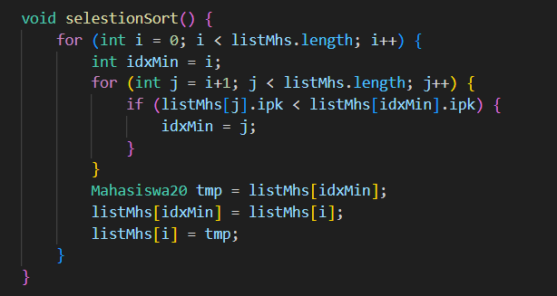
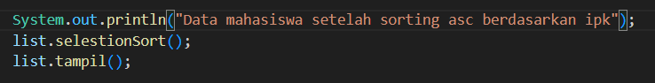
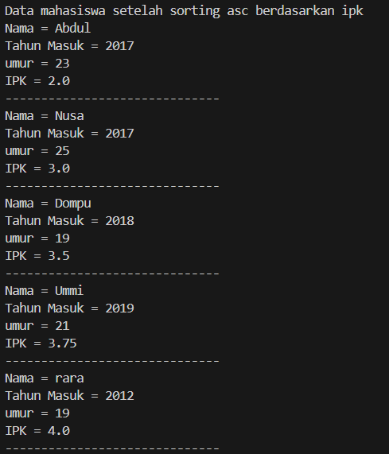
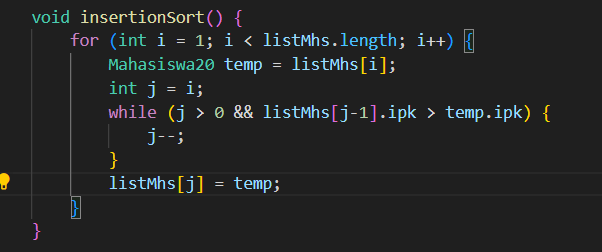
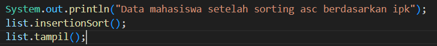
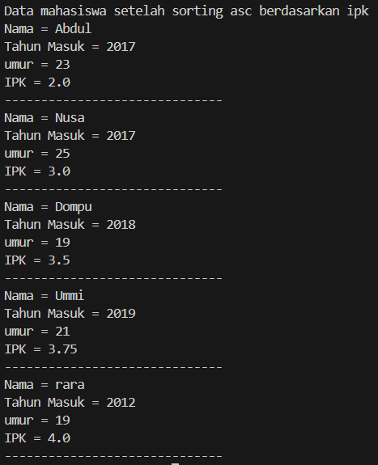
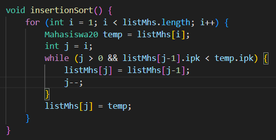

## jobsheet 5

# Percobaan 1 : Mengurutkan Data Mahasiswa Berdasarkan IPK Menggunakan Bubble Sort

Kode Program

> 
> 

main

> 

vertifikasi hasik kode program

> 
> 

Pertanyaan

1. Terdapat di method apakah proses bubble sort?
2. Di dalam method bubbleSort(), terdapat baris program seperti di bawah ini:
Untuk apakah proses tersebut?
3. Perhatikan perulangan di dalam bubbleSort() di bawah ini:
- Apakah perbedaan antara kegunaan perulangan i dan perulangan j?
- Mengapa syarat dari perulangan i adalah i<listMhs.length-1 ?
- Mengapa syarat dari perulangan j adalah j<listMhs.length-i ?
- Jika banyak data di dalam listMhs adalah 50, maka berapakali perulangan i akan berlangsung? Dan ada berapa Tahap bubble sort yang ditempuh?

Jawaban

1. > 
2. Proses tersebut adalah bagian dari algoritma Bubble Sort yang digunakan untuk mengurutkan elemen-elemen dalam array listMhs berdasarkan nilai ipk secara descending (menurun).
3. 
- Perulangan i digunakan untuk mengontrol jumlah putaran (iterasi) utama dalam algoritma Bubble Sort, Sedangkan perulangan j digunakan untuk mengontrol proses perbandingan dan pertukaran elemen-elemen dalam setiap putaran.
- Syarat i < listMhs.length memastikan perulangan luar berjalan sebanyak jumlah elemen dalam array.
- Syarat j < listMhs.length - i digunakan untuk mengoptimalkan proses perbandingan dan pertukaran elemen, dengan menghindari perbandingan elemen yang sudah terurut pada putaran sebelumnya. 
- Jika terdapat 50 data dalam listMhs, perulangan i akan berlangsung sebanyak 50 kali, dan terdapat 50 tahap Bubble Sort yang ditempuh untuk mengurutkan seluruh elemen secara descending berdasarkan nilai ipk.

# Percobaan 2 :  Mengurutkan Data Mahasiswa Berdasarkan IPK Menggunakan Selection Sort

Kode Program

> 
> 

main

> 

vertifikasi hasik kode program

> 
> 

Pertanyaan

1. Di dalam method selection sort, terdapat baris program seperti di bawah ini:
Untuk apakah proses tersebut, jelaskan!

Jawaban

1. Kode tersebut bertujuan untuk menemukan indeks dari elemen terkecil (dalam hal ini, Mahasiswa20 dengan ipk terkecil) dalam bagian array yang belum diurutkan.

# Percobaan3 : Mengurutkan Data Mahasiswa Berdasarkan IPK Menggunakan Insertion Sort

Kode Program

> 
> 

main

> 

vertifikasi hasil kode program

> 
> 

Pertanyaan

1. Ubahlah fungsi pada InsertionSort sehingga fungsi ini dapat melaksanakan proses sorting dengan cara descending.

jawaban

1. 
> 