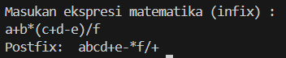

## JOBSHEET 7

# Percobaan 1: Penyimpanan Tumpukan Barang dalam Gudang

Output
> 
> 

Pertanyaan

1. Lakukan perbaikan pada kode program, sehingga keluaran yang dihasilkan sama dengan verifikasi hasil percobaan! Bagian mana saja yang perlu diperbaiki?
2. Berapa banyak data barang yang dapat ditampung di dalam tumpukan? Tunjukkan potongan kode programnya!
3. Mengapa perlu pengecekan kondisi !cekKosong() pada method tampilkanBarang? Kalau kondisi tersebut dihapus, apa dampaknya?
4. Modifikasi kode program pada class Utama sehingga pengguna juga dapat memilih operasi lihat barang teratas, serta dapat secara bebas menentukan kapasitas gudang!
5. Commit dan push kode program ke Github

Jawaban

1. Bagian yang perlu diperbaiki sehingga keluaran yang dihasilkan benar adalah pada class Gudang20 pada bagian tampilkanBarang yaitu format string pada printf.
2. data yang dapat ditampung berjumlah 7 kode program = 
> (Gudang20 gudang = new Gudang20(7);)
3. untuk memastikan kondisi tidak kosong sebelum menampilkan barang, jika tidak ada maka kode program akan tetap mencoba menampilkan barang meskipun kosong.
4. 
> 
> 
5. di github

# Percobaan 2: Konversi Kode Barang ke Biner 

Output

> 

Pertanyaan

1. Pada method konversiDesimalKeBiner, ubah kondisi perulangan menjadi while (kode != 0), bagaimana hasilnya? Jelaskan alasannya!
2. Jelaskan alur kerja dari method konversiDesimalKeBiner!

Jawaban

1. Setelah diubah menjadi while (kode != 0), perulangan akan dilakukan selama kode tidak sama dengan 0.
2. Alur Kerja Method konversiDesimalKeBiner:
- objek StackKonversi10 dibuat untuk menyimpan sisa pembagian bilangan desimal dengan 2, Selama kode tidak sama dengan 0 (while (kode != 0)):
- kemudian menghitung sisa pembagian kode dengan 2 (int sisa = kode % 2).
- lalu memasukkan sisa tersebut ke dalam stack menggunakan metode push. setelah itu membagi kode dengan 2 untuk memperoleh nilai kode baru yang akan digunakan pada iterasi berikutnya.
- Setelah semua sisa pembagian dimasukkan ke dalam stack, lakukan iterasi melalui stack untuk mengambil nilai sisa dan tambahkan ke string biner menggunakan StringBuilder.
- lalu mengembalikan string biner yang berisi representasi biner dari bilangan desimal.

# Percobaan 3: Konversi Notasi Infix ke Postfix

> 

Pertanyaan

1. Pada method derajat, mengapa return value beberapa case bernilai sama? Apabila return
value diubah dengan nilai berbeda-beda setiap case-nya, apa yang terjadi?
2. Jelaskan alur kerja method konversi!
3. Pada method konversi, apa fungsi dari potongan kode berikut?

jawaban

1. Dalam method derajat, beberapa return value sama karena mereka mewakili prioritas operator dalam ekspresi. Operator dengan prioritas lebih tinggi harus dievaluasi terlebih dahulu. Jika mengubah return value menjadi angka yang berbeda untuk setiap kasus, urutan prioritas dalam mengevaluasi operator akan terganggu.
2. 
- Jika adalah operand, maka langsung ditambahkan ke variabel P
- Jika c adalah '(', maka ditambahkan ke stack menggunakan method push().
- jika c adalah ')', maka semua karakter pada stack ditambahkan pada variabel P sampai '(' ditemukan dan '(' kemudian dihapus dari stack dengan method pop().
- jika c adalah operator, maka char operator pada stack dengan kedudukan prioritas yang lebih tinggi ditambah di variabel P sampai char operator yang lebih rendah atau sama ditemukan dan operator tersebut kemudian ditambahkan menggunakan method push().
- Setelah semua iterasi selesai, method mereturn nilai pada variabel P
3. Memasukkan char ke i pada String Q ke dalam variabel c (i sesuai dengan iterasinya dalam perulangan).

TUGAS
Perhatikan dan gunakan kembali kode program pada Percobaan 1. Tambahkan dua method berikut

pada class Gudang:

• Method lihatBarangTerbawah digunakan untuk mengecek barang pada tumpukan terbawah
> 
• Method cariBarang digunakan untuk mencari ada atau tidaknya barang berdasarkan kode barangnya atau nama barangnya
> 

