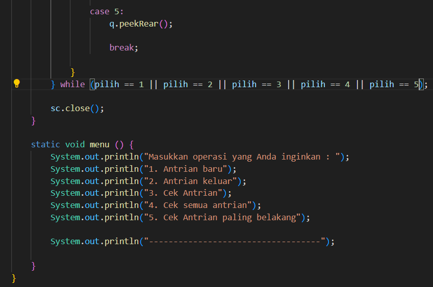

## JOBSHEET 9

# 1 Pembuatan Single Linked List

verifikasi hasil kode program

> 

Pertanyaan
1. Mengapa hasil compile kode program di baris pertama menghasilkan “Linked List Kosong”?
2. Jelaskan kegunaan variable temp secara umum pada setiap method!
3. Perhatikan class SingleLinkedList, pada method insertAt Jelaskan kegunaan kode berikut 

Jawaban
1. Hasil compile kode program di baris pertama menghasilkan "Linked List Kosong" karena pada awal kode program, linked list masih dalam keadaan kosong. Metode print() akan memeriksa kondisi linked list menggunakan metode isEmpty(). Jika linked list kosong, maka akan menampilkan output "Linked list kosong".
2. Variabel temp secara umum digunakan sebagai variabel sementara (temporary variable) pada setiap metode yang melibatkan operasi pada node-node dalam linked list. Kegunaan variabel temp secara spesifik pada setiap metode adalah:

- Metode print(): Variabel temp digunakan untuk menyimpan referensi node saat ini dalam iterasi untuk mencetak nilai-nilai node pada linked list.
- Metode insertAfter(int key, int input): Variabel temp digunakan untuk menyimpan referensi node saat ini dalam iterasi untuk mencari node dengan nilai key yang diberikan.
- Metode insertAt(int index, int input): Variabel temp digunakan untuk menyimpan referensi node saat ini dalam iterasi untuk mencari node sebelum indeks yang ditentukan.
3. Kode if(temp.next.next == null){ tail = temp.next; } digunakan untuk memperbarui nilai variabel tail dalam linked list ketika node baru yang ditambahkan menjadi node terakhir dalam linked list.

