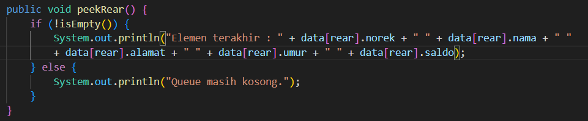

Pertanyaan percobaan 1

1. Pada konstruktor, mengapa nilai awal atribut front dan rear bernilai -1, sementara atribut size 
bernilai 0?
2. Pada method Enqueue, jelaskan maksud dan kegunaan dari potongan kode berikut!
3. Pada method Dequeue, jelaskan maksud dan kegunaan dari potongan kode berikut!
4. Pada method print, mengapa pada proses perulangan variabel i tidak dimulai dari 0 (int i=0), 
melainkan int i=front?
5. Perhatikan kembali method print, jelaskan maksud dari potongan kode berikut!
6. Tunjukkan potongan kode program yang merupakan queue overflow!
7. Pada saat terjadi queue overflow dan queue underflow, program tersebut tetap dapat berjalan 
dan hanya menampilkan teks informasi. Lakukan modifikasi program sehingga pada saat terjadi 
queue overflow dan queue underflow, program dihentikan!

Jawaban

1. Nilai awal atribut front dan rear diinisialisasi dengan nilai -1 karena ini merupakan konvensi yang digunakan untuk menandai bahwa queue masih kosong. Ketika queue kosong, nilai front dan rear diatur menjadi -1 sebagai tanda bahwa tidak ada elemen yang ada di queue. Sedangkan atribut size diinisialisasi dengan nilai 0 karena pada awal tidak ada elemen di dalam queue, sehingga ukurannya adalah 0.
2. Potongan kode ini digunakan untuk mengatur nilai rear (indeks elemen terakhir) setelah memasukkan elemen baru ke dalam queue. Jika rear sudah mencapai indeks maksimum (max - 1), maka rear akan diatur ke 0 (kembali ke indeks awal). Ini dilakukan untuk mengimplementasikan konsep circular queue, di mana setelah mencapai akhir array, queue akan kembali ke awal array. Jika rear belum mencapai indeks maksimum, maka rear akan diinkremen dengan 1.
3. Potongan kode ini digunakan untuk mengatur nilai front (indeks elemen terdepan) setelah mengeluarkan elemen dari queue. Jika front sudah mencapai indeks maksimum (max - 1), maka front akan diatur ke 0 (kembali ke indeks awal). Ini juga dilakukan untuk mengimplementasikan konsep circular queue. Jika front belum mencapai indeks maksimum, maka front akan diinkremen dengan 1.
4. Variabel i tidak dimulai dari 0 karena queue dapat memiliki elemen di posisi awal yang bukan indeks 0. Dengan menggunakan i = front, perulangan akan dimulai dari indeks elemen terdepan (front), yang mungkin tidak selalu 0. Ini dilakukan untuk mencetak elemen-elemen dalam urutan yang benar, sesuai dengan urutan enqueue.
5. Potongan kode ini digunakan untuk mencetak setiap elemen dalam queue dan mengupdate nilai variabel i untuk mencapai elemen berikutnya. System.out.print(data[i] + " "); mencetak elemen pada indeks i di dalam array data. Kemudian, i = (i + 1) % max; memperbarui nilai i dengan menggunakan operasi modulo (%). Operasi modulo digunakan untuk mengimplementasikan konsep circular queue, di mana setelah mencapai akhir array, indeks akan kembali ke awal array.
6. if (isFull()) {
    System.out.println("Queue sudah penuh");
    }
7. Untuk menghentikan program saat terjadi queue overflow dan queue underflow, Dapat dimodifikasi kode dengan menambahkan System.exit(0); setelah menampilkan pesan error.

enqueue
if (isFull()) {
    System.out.println("Queue sudah penuh");
    System.exit(0); // Menghentikan program
}

dequeue

if (isEmpty()) {
    System.out.println("Queue masih kosong");
    System.exit(0); // Menghentikan program
}

Pertanyaan percobaan 2

1. Pada class QueueMain, jelaskan fungsi IF pada potongan kode program berikut!
2. Lakukan modifikasi program dengan menambahkan method baru bernama peekRear pada class 
Queue yang digunakan untuk mengecek antrian yang berada di posisi belakang! Tambahkan pula 
daftar menu 5. Cek Antrian paling belakang pada class QueueMain sehingga method peekRear
dapat dipanggil!

Jawaban

1. Fungsi dari potongan kode IF tersebut adalah untuk memeriksa apakah objek Nasabah20 yang baru saja dikeluarkan dari antrian (q.dequeue()) memiliki data yang valid atau tidak. Dengan kata lain, kode tersebut memeriksa apakah atribut-atribut dari objek Nasabah20 tidak kosong atau nol (0).
2. 
> 
> 

Tugas 

Buatlah program antrian untuk mengilustasikan pesanan disebuah warung. Ketika seorang 
pembeli akan mengantri, maka dia harus mendaftarkan nama, dan nomor HP seperti yang 
digambarkan pada Class diagram berikut:
Class diagram Queue digambarkan sebagai berikut:

Keterangan:

• Method create(), isEmpty(), isFull(), enqueue(), dequeue() dan print(), kegunaannya sama seperti 
yang telah dibuat pada Praktikum
• Method peek(): digunakan untuk menampilkan data Pembeli yang berada di posisi antrian paling 
depan
• Method peekRear(): digunakan untuk menampilkan data Pembeli yang berada di posisi antrian 
paling belakang
• Method peekPosition(): digunakan untuk menampilkan seorang pembeli (berdasarkan nama)
posisi antrian ke berapa
• Method daftarPembeli(): digunakan untuk menampilkan data seluruh pembeli

Jawaban

di file repo bernama tugas